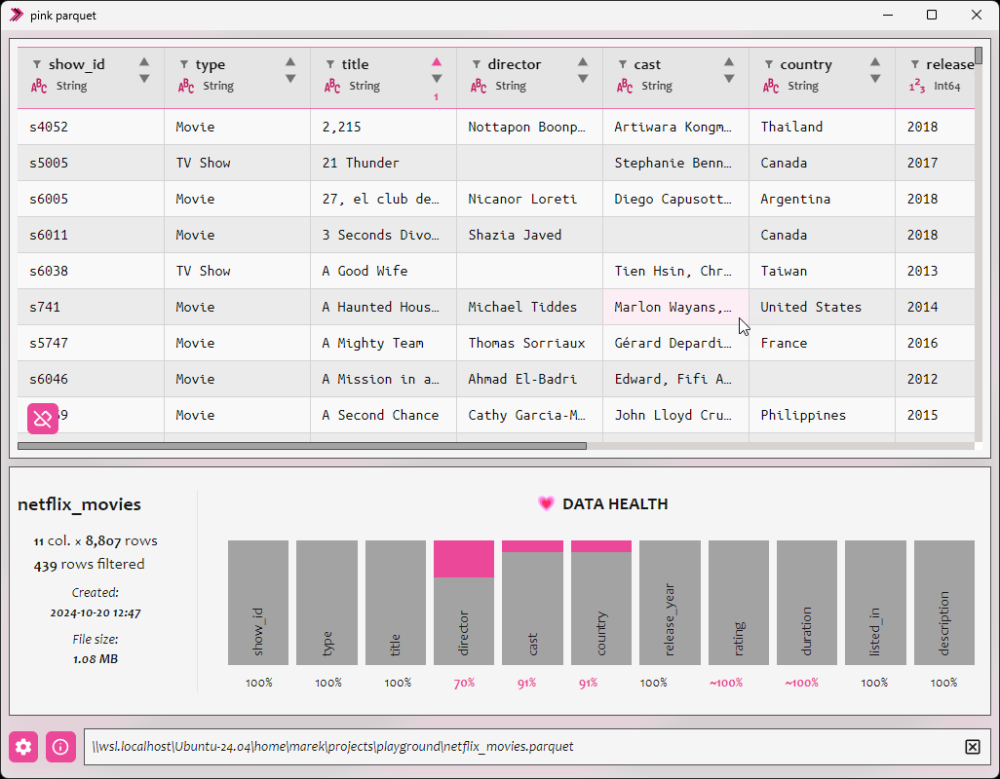

# Pink Parquet

**Pink Parquet** is a free and open-source, user-friendly viewer
for Parquet files. It allows you to easily open, view, and analyze
Parquet data without any hassle.

### Features

- **User-Friendly Interface**: Navigate your Parquet files with ease.
- **Open Source**: Completely free and open-sourced under the MIT License.
- **Windows Support**: Pre-built binaries available for Windows.
- **Build from Source**: Supports macOS and Linux through source compilation.
- **Lightweight and Fast**: Built with Tauri, Polars (Rust), and Nuxt.js for efficient performance.
- **Drag and Drop**: Simply drag your Parquet files into the app to view them.

### Screenshot



## Technologies Used

Tauri: For building the desktop application with minimal footprint.
Polars (Rust): A fast DataFrame library for Rust, used for data manipulation.
Nuxt.js: A Vue.js framework for building the frontend interface.

## Installation

### Windows

1. Download the latest Windows installer from the [project's homepage](https://pinkparquet.com).
2. Run the installer and follow the on-screen instructions.

## macOS and Linux

Pre-built binaries are not available for macOS and Linux at this time. However,
you can build the application from source by following the instructions below.

## Building from Source

### Prerequisites

- [Rust](https://www.rust-lang.org/): Install via `rustup.rs`.
- [Node.js](https://nodejs.org/en): Install from nodejs.org.
- [Tauri](https://tauri.app/) Requirements: Follow the Tauri prerequisites for your operating system.

### Steps

Clone the repository:

```bash
git clone https://github.com/marepilc/pink-parquet.git
```

Navigate to the project directory:

```bash
cd pink-parquet
```

Install the dependencies:

```bash
npm install
```

Build the application:

- For development:

```bash
npm run tauri dev
```

- For production (Standard x64):

```bash
npm run tauri build
```

The built application will be located in the `src-tauri/target/release/bundle` directory.

### ARM64 Windows Builds

To build for ARM64 Windows (`aarch64-pc-windows-msvc`), follow the **Native Visual Studio** method (most reliable).

#### 1. Native Visual Studio Method (Recommended)

This method uses the official Microsoft compilers and is the most reliable for crates like `ring` and `psm` which
contain assembly code.

1. **Install ARM64 Build Tools**:
    - Open **Visual Studio Installer**.
    - Click **Modify** on your Visual Studio 2022 installation.
    - On the **Workloads** tab, ensure **Desktop development with C++** is checked.
    - On the **Individual Components** tab, search for and install: **MSVC v143 - VS 2022 C++ ARM64 build tools (Latest)
      **.
2. **Add Rust Target**:
   ```powershell
   rustup target add aarch64-pc-windows-msvc
   ```
3. **Build using Developer PowerShell**:
    - Search for **"Developer PowerShell for VS 2022"** in your Start Menu and open it.
    - **Initialize the ARM64 environment** by running:
      ```powershell
      Import-Module "C:\Program Files\Microsoft Visual Studio\2022\Community\Common7\Tools\Microsoft.VisualStudio.DevShell.dll"
      Enter-VsDevShell -VsInstallPath "C:\Program Files\Microsoft Visual Studio\2022\Community" -DevCmdArguments "-arch=arm64 -host_arch=x64"
      ```
    - **Verify** the environment: `armasm64 /?` should show help text, not an error.
    - Navigate to your project folder: `cd path/to/pink-parquet`
    - Run the build:
      ```powershell
      npx tauri build --target aarch64-pc-windows-msvc
      ```

#### 2. Alternative: Cross-compiling with cargo-xwin

Use this if you don't want to install the full ARM64 toolchain, though it may fail for certain cryptography crates.

**Prerequisites:**

- **LLVM**: Install via `winget install -e --id LLVM.LLVM`. Ensure `C:\Program Files\LLVM\bin` is in your `PATH`.
- **cargo-xwin**: `cargo install cargo-xwin`.

**Build Command:**

```powershell
$env:CC = "clang-cl"; $env:CXX = "clang-cl"; npx tauri build --target aarch64-pc-windows-msvc --runner cargo-xwin
```

#### Troubleshooting Build Errors

**'vcruntime.h' or 'cl.exe' not found**
This means you are not using the **Developer PowerShell** or the environment hasn't been initialized with the
`Enter-VsDevShell` command above.

**Symlink Privilege Error (os error 1314)**
If using `cargo-xwin`, enable **Developer Mode** in Windows Settings to allow symlink creation.

**Clang /imsvc Error**
If you see `clang: error: no such file or directory: '/imsvc'`, ensure you are setting `$env:CC = "clang-cl"` (with the
`-cl` suffix) before building to use the MSVC-compatible driver.

## Contributing

Contributions are welcome! If you have any ideas, suggestions, or bug reports,
please open an issue or submit a pull request.

